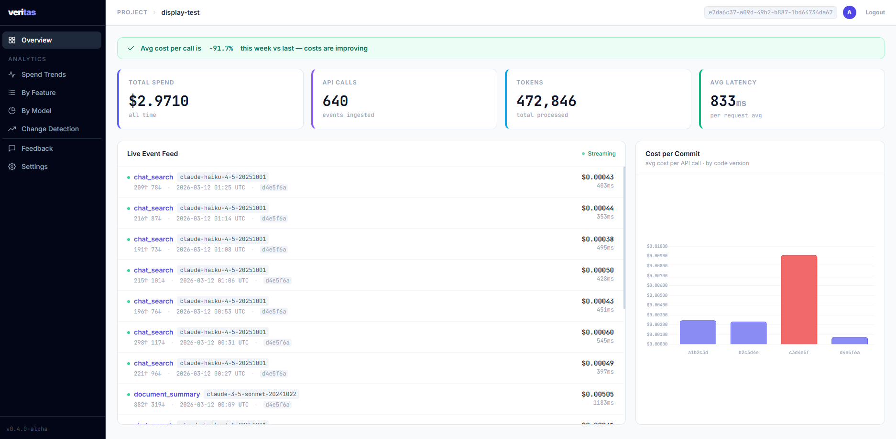
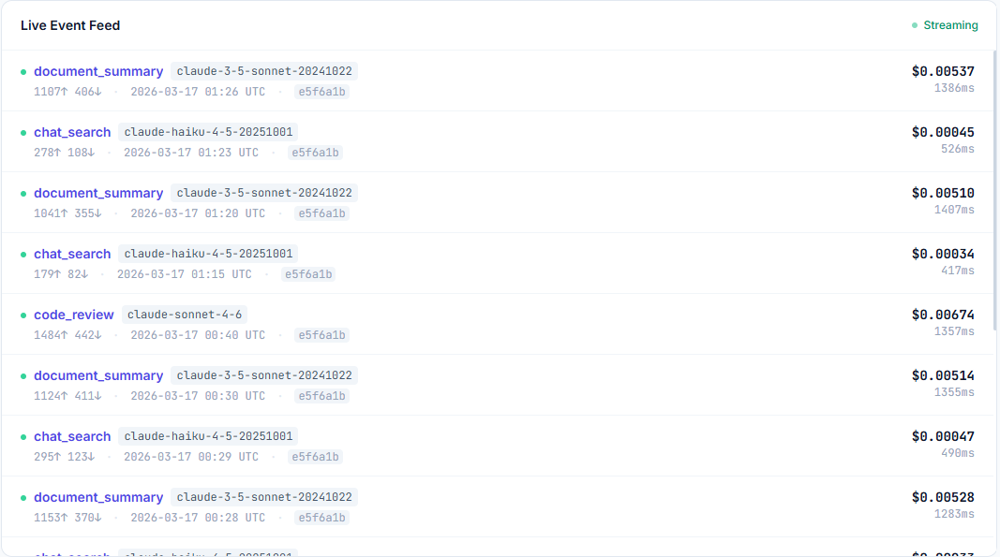
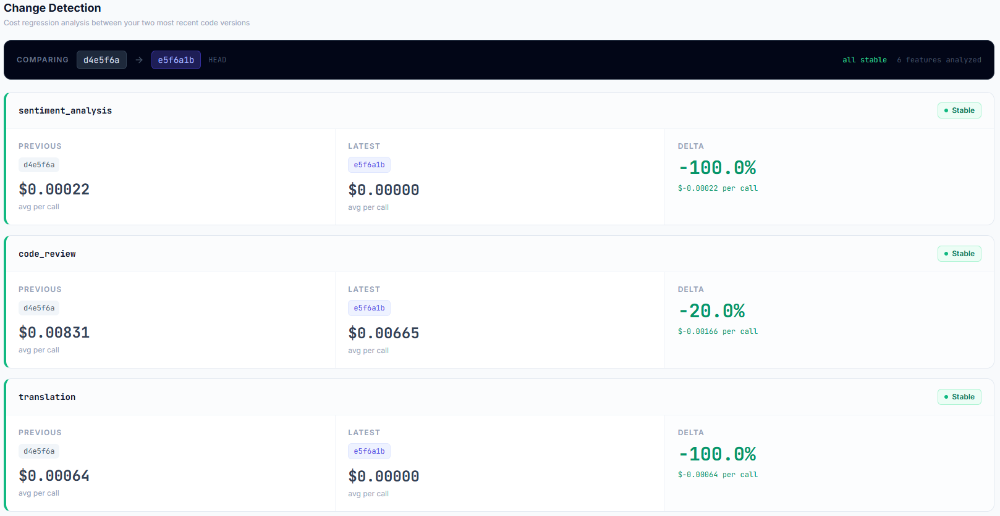
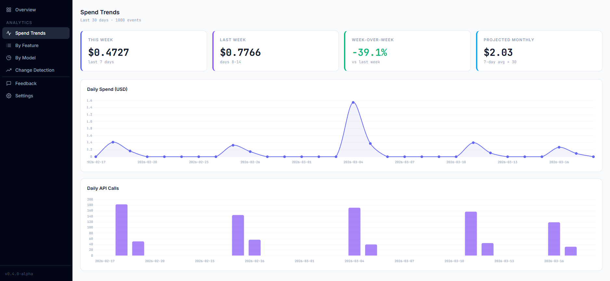
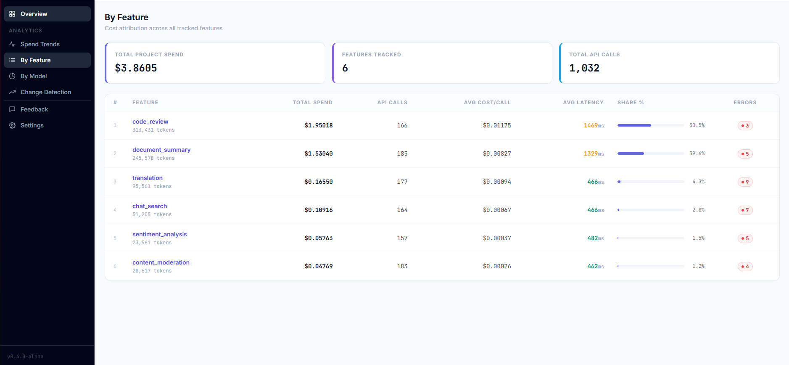
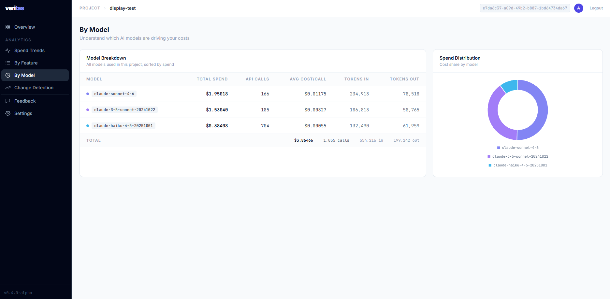

# Veritas

**AI cost observability for developers.** Track token usage, costs, and latency across every LLM call — automatically. Spot cost regressions before they hit production.

```bash
pip install veritas-sdk[anthropic]
# or
pip install veritas-sdk[openai]
# or
pip install veritas-sdk[all]
```

---

## What it does

Veritas wraps your existing Anthropic or OpenAI client with a transparent proxy. Every API call is tracked silently in the background — your application code stays identical.

For every call, Veritas captures:

| Field | Description |
|-------|-------------|
| `feature` | The feature name you assign |
| `model` | Model used (e.g. `claude-3-haiku`, `gpt-4o-mini`) |
| `tokens_in / tokens_out` | Input and output token counts |
| `cost_usd` | Computed cost based on current pricing |
| `latency_ms` | End-to-end request time |
| `code_version` | Current git commit hash — **auto-detected** |

Events are sent to your Veritas dashboard where you can track spend over time, break costs down by feature, and automatically detect cost regressions between code versions.

---

## Dashboard

**[Sign up free at web-production-82424.up.railway.app](https://web-production-82424.up.railway.app/auth/signup)**

### Overview


The main dashboard shows your total spend, call volume, token usage, and average latency — with a week-over-week health banner that tells you if costs are rising or stable.

### Cost by Commit


Every event is tagged with the git commit hash it ran on — automatically, with no configuration. The commit chart lets you see exactly which code version changed your costs.

### Regression Detection


The regressions page automatically compares your two most recent commits across every tracked feature — no manual commit entry. Red rows = cost went up.

### Trends


30-day cost and call volume trends with projected monthly spend and week-over-week comparison.

### Feature Analytics


Break down costs by feature — total spend, average cost per call, error rate, and percentage share of your total AI bill.

### Model Analytics


See which models you're spending on and how token usage is distributed across them.

---

## Quickstart

### 1. Sign up and get your API key

[Create a free account](https://web-production-82424.up.railway.app/auth/signup), then go to Settings to create a project and get your API key.

### 2. Configure

```python
import veritas

veritas.init(
    api_key="sk-vrt-your-key-here",
    endpoint="https://web-production-82424.up.railway.app/api/v1/events",
)
```

Or use environment variables — Veritas auto-configures on import:

```bash
VERITAS_API_KEY=sk-vrt-your-key-here
VERITAS_API_URL=https://web-production-82424.up.railway.app/api/v1/events
```

### 3. Wrap your client

**Anthropic:**

```python
import anthropic
import veritas

veritas.init(api_key="sk-vrt-...", endpoint="https://web-production-82424.up.railway.app/api/v1/events")

client = veritas.Anthropic(
    anthropic.Anthropic(),
    feature_name="chat_search",   # group calls by feature in the dashboard
)

response = client.messages.create(
    model="claude-3-haiku-20240307",
    max_tokens=256,
    messages=[{"role": "user", "content": "Hello!"}],
)
# ^ tracked automatically — response is unchanged
```

**OpenAI:**

```python
import openai
import veritas

veritas.init(api_key="sk-vrt-...", endpoint="https://web-production-82424.up.railway.app/api/v1/events")

client = veritas.OpenAI(
    openai.OpenAI(),
    feature_name="summarizer",
)

response = client.chat.completions.create(
    model="gpt-4o-mini",
    messages=[{"role": "user", "content": "Hello!"}],
)
```

Streaming works too — just pass `stream=True` as normal.

### 4. Use the `@track` decorator (alternative)

```python
from veritas import track

@track(feature="document_summary")
def summarize(text: str):
    return anthropic_client.messages.create(...)   # any call that returns usage data
```

---

## CLI — Compare commits

After collecting data, compare any two commits from the terminal:

```bash
veritas diff --feature chat_search --from abc1234 --to def5678
```

```
---------------------------------------------------------------
Metric          |Commit A (Base)  |Commit B (Target)|Delta
---------------------------------------------------------------
Samples         |120              |134              |-
Avg Cost/Req    |$0.000412        |$0.000589        |$0.000177 (42.96%)
Avg Tokens In   |312.4            |451.2            |138.8
Avg Tokens Out  |89.1             |112.3            |23.2
---------------------------------------------------------------

Verdict:
❌ REGRESSION DETECTED: Cost increased beyond acceptable thresholds.
```

Exits with code `1` on regression — drop it straight into CI:

```yaml
# .github/workflows/cost-check.yml
- name: Check cost regression
  run: veritas diff --feature chat_search --from ${{ github.event.before }} --to ${{ github.sha }}
```

---

## Safety guarantees

- **Never crashes your app** — all tracking is fire-and-forget; exceptions are swallowed silently
- **No prompt data transmitted** — only metadata (tokens, cost, latency, model, commit hash)
- **Async-safe** — uses `asyncio.to_thread` in async contexts so the event loop is never blocked
- **Zero-config git integration** — commit hash is auto-detected via `git rev-parse`

---

## Requirements

- Python 3.9+
- `requests` (for HTTP sink)
- `anthropic>=0.39` (if using `veritas-sdk[anthropic]`)
- `openai>=1.0.0` (if using `veritas-sdk[openai]`)

---

## Links

- [GitHub](https://github.com/abhigyan1290/veritas-ai)
- [Dashboard](https://web-production-82424.up.railway.app)
